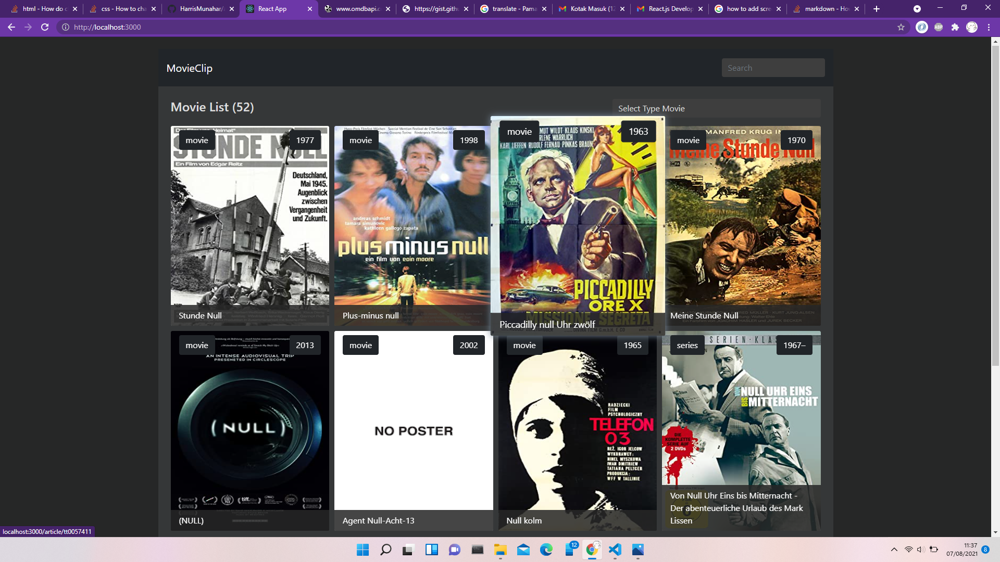

## Project Stockbit React Dev Test 

#### MovieClip: 

An application used to filter data form Movie based on user preference, built with React, Redux, JavaScript, and CSS.

## Project Screen Shot(s)

## Installation and Setup Instructions

#### Example:  

Clone down this repository. You will need `node` and `npm` installed globally on your machine.  

Installation:

`npm install or yarn`  

To Run Test Suite:  

`npm test`  

To Start Server:

`npm start or yarn start`  

To Visit App:

`localhost:3000`  

### Expectation

## Features to be implemented:
- Display List of movies
- Use Infinite Scroll tanpa plugin untuk jumlah search result yg panjang > 5
- Search movies by keyword
- Single Page for Single Movie Detail
- Show Movie Poster in a popup modal window when image from the list is clicked
- Unit test for components
- Autocomplete searchbox implementation is a big plus

## Project must use/have :
- ReactJS
- Redux
- Axios
- Good, sensible file structuring that promotes modularity and good separation of logical/UI layers
- Written Test Cases for the components
- Showing some display of React Hooks knowledge is a plus
- Clear instructions on how to run your app locally. Please provide clear explanations about

your project and how do we run it locally (using README.md is preferable)